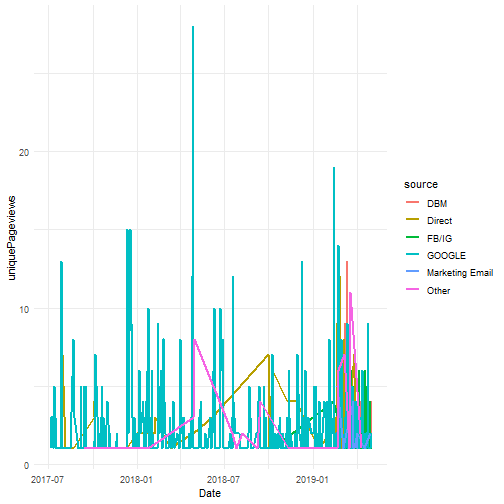

KPI Slides
========================================================
author: 
date: 
autosize: true

First Slide
========================================================


```r
library(dplyr)
library(knitr)
library(ggplot2)
```


```r
RSP <- read.csv("file:///C:/Users/christine.iyer/Box/KPI/KPI/RSP.csv", header = T, stringsAsFactors = F)
RSP1 <- RSP %>% mutate(Date = as.Date(Date, format = "%m/%d/%Y"),
  source= ifelse(source == "DBM", source,
                                     ifelse(source == "FB", "FB/IG", 
                                            ifelse(source == "GOOGLE", source, 
                                                   ifelse(source == "IG", "FB/IG", 
                                                          ifelse(source == "(DIRECT)", "Direct", 
                                                                 ifelse(source == "YAHOO", "GOOGLE", 
                                                                        ifelse(source == "CM", "Marketing Email", 
                                                                               ifelse(source == "TARGETX", "Marketing Email", "Other")))))))))
head(RSP1)
```

```
        Date                                            landingPagePath
1 2017-07-04 /office-of-admissions/new-england-regional-tuition-program
2 2017-07-06 /office-of-admissions/new-england-regional-tuition-program
3 2017-07-08 /office-of-admissions/new-england-regional-tuition-program
4 2017-07-10 /office-of-admissions/new-england-regional-tuition-program
5 2017-07-11 /office-of-admissions/new-england-regional-tuition-program
6 2017-07-12 /office-of-admissions/new-england-regional-tuition-program
  source  medium        Ad  campaign        region       city
1 GOOGLE ORGANIC (NOT SET) (not set)       Vermont    Chester
2 GOOGLE ORGANIC (NOT SET) (not set) New Hampshire      Derry
3 GOOGLE ORGANIC (NOT SET) (not set) Massachusetts  Arlington
4 GOOGLE ORGANIC (NOT SET) (not set)      New York   New York
5 GOOGLE ORGANIC (NOT SET) (not set)        Lisbon     Lisbon
6 GOOGLE ORGANIC (NOT SET) (not set)       Vermont Montpelier
  uniquePageviews bounces timeOnPage sessions newUsers pageviews exits
1               1       1          0        1        1         1     1
2               3       0        155        1        1         4     1
3               3       0         27        1        1         3     1
4               3       0        111        1        0         3     1
5               1       1          0        1        1         1     1
6               5       0        102        1        1         8     1
  sessionDuration
1               0
2             156
3              27
4             111
5               0
6             101
```


For more details on authoring R presentations please visit <https://usm.maine.edu/office-of-admissions/new-england-regional-tuition-program>.

- Bullet 1
- Bullet 2
- Bullet 3


Slide With Plot
========================================================

```r
# Multiple line plot
ggplot(RSP1, aes(x = Date, y = uniquePageviews)) + 
  geom_line(aes(color = source), size = 1) +
  #scale_color_manual(values = c("#00AFBB", "#E7B800")) +
  theme_minimal()
```




Slide With Code
========================================================


```r
kable(RSP1 %>% group_by(source) %>% summarise(n = sum(uniquePageviews)) %>% arrange(desc(n)))
```


|source          |    n|
|:---------------|----:|
|FB/IG           | 1522|
|DBM             | 1164|
|GOOGLE          |  982|
|Direct          |  150|
|Other           |   54|
|Marketing Email |   27|


